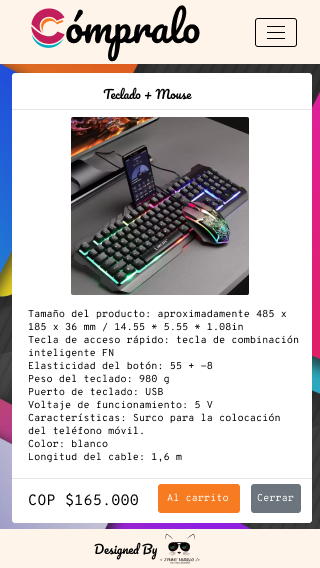

<p align="center"> 
  
</p>

# ¡Un cliente real!

Llegó el momento de interactuar con un cliente real para ello buscaremos un  establecimiento de alimentos de nuestro sector y/o el emprendimiento de un amigo o familiar, ofrecemos nuestros servicios de Programadores y donaremos un desarrollo  en React el cual será una interfaz interactiva que reciba los inputs del usuario y se los entregué al dueño del comercio como un pedido digital.

<br>
<br>

# ¡Aplicación desarrollada para aplicar conocimientos de "React" e interactuar con un cliente real!


<br>
<br>

## Mockups de este proyecto 🛠️
Son varias vistas las que componen el proyecto, las cuales se encuentran en la carpeta [Mockups](./public/Mockups). A continuación se muestra el Mockup de la vista móvil de la descripcion de productos y carrito de compras en éste proyecto:

<p align="center"> 
  
</p>

<p align="center"> 
  
</p>

## Capturas de Pantalla ⚙️

A continuación se muestran un fragmento de código, mostarndo parte de la maquetación y el llamado a los diferentes componentes creados en la aplicacion de React:

<p style="font-weight:bold" align="center">JAVASCRIPT</p>

```JAVASCRIPT
import "./App.css";
import { useState } from "react";
import { BrowserRouter, Route, Routes, Navigate } from "react-router-dom";
import { CartProvider } from "react-use-cart";
import NavBar from "./components/NavBar";
import Footer from "./components/Footer";
import HomePage from "./pages/Home";
import Categories from "./pages/Categories";
import Products from "./pages/Products";
import ShoppingCart from "./pages/ShoppingCart";
import ShoppingSummary from "./pages/ShoppingSummary";

function App() {
  const [categoryName, setCategoryName] = useState("");

  function handleCategoryName(name) {
    setCategoryName(name);
  }
  console.log("estoy en app", categoryName);

  const [cartItems, setCartItems] = useState([]);
  const [totalCart, setTotalCart] = useState("");

  function handleCartItems(items, totalCart) {
    setCartItems(items);
    setTotalCart(totalCart);
  }

  return (
    <BrowserRouter>
      <div className="own-bg-body-app">
        <div>
          <NavBar />
        </div>

        <div className="own-body-pages px-2 d-flex flex-column justify-content-center">
          <CartProvider>
            <Routes>
              <Route path="" element={<HomePage />} />
              <Route path="/" element={<HomePage />} />
              <Route path="/home" element={<HomePage />} />
              <Route
                path="/categories"
                element={<Categories handleCategoryName={handleCategoryName} />}
              />
              <Route
                path="/products"
                element={<Products categoryName={categoryName} />}
              />

              <Route
                path="/categories/products"
                element={<Navigate to="/products" />}
              />
              <Route
                path="/shoppingcart"
                element={<ShoppingCart handleCartItems={handleCartItems} />}
              />
              <Route
                path="/shoppingsummary"
                element={
                  <ShoppingSummary
                    cartItems={cartItems}
                    totalCart={totalCart}
                  />
                }
              />
            </Routes>
          </CartProvider>
        </div>

        <div className="fixed-bottom">
          <Footer />
        </div>
      </div>
    </BrowserRouter>
  );
}

export default App;

```

## Requerimientos técnicos ⚙️
**Contexto del proyecto**

Este será tu primer reto profesional enfocado en un cliente real, tendrás que sacar tus habilidades de comunicación asertiva y tus habilidades de manejo de cliente.

Simultáneo a la práctica de estas habilidades blandas y ponerlas en un contexto real, evaluaremos el código para cumplir con las primeras tres competencias dedicadas al frontend de nuestro bootcamp en su nivel 3, también tendremos en cuenta la usabilidad e interactividad del usuario final.

Recuerda las recomendaciones que te hemos dado hasta este momento para recibir la competencia nivel 3.

​

⚙️**Requerimientos técnicos Generales:**

- Realizar un planning y product backlog respetando las fechas de las entregas

- Se requiere estudio previo del negocio del cliente
- Se requiere Mockup
- Se requiere Prototipo
- El desarrollo debe ser con React
- El desarrollo debe usar CSS para dar estilos, puedes hacer uso de alguna librería
- El desarrollo debe contar con un carrito de compra (no es pasarela de pago)
- El desarrollo debe tener la funcionalidad de al finalizar el pedido, el establecimiento debe recibirlo a través de WhatsApp (debe incluir los productos, la cantidad de productos, el total de cada producto dependiendo de las unidades pedidas y el total de todo el pedido, si ves algún dato más relevante puedes agregarlo)
- El desarrollo debe estar en inglés al 100% menos para los strings que ve el usuario final pues estos deben estar en Español.
- El desarrollo debe contar con filtros de categorías para los diversos productos
- El desarrollo debe contar con documentación técnica (debe ser bien documentado para futuros mantenimientos o estabilidad)
- El desarrollo debe respetar la carta gráfica del cliente o la que ustedes le propongan al cliente (en caso de no tenerla deben diseñar la carta gráfica con logo, paletas de colores)
​

- El desarrollo debe ser RESPONSIVE con uso de la estrategia Mobile First
- El desarrollo debe contar con las siguientes vistas:

  - Bienvenida a la tienda y descripción del negocio

  - Productos (acá se debe manejar el filtro de categorías)

  - Carrito de compras

  - Resúmen de las compras con botón para hacer el domicilio vía WhatsApp

​

⚙️**Requerimientos técnicos Productos:**


- El desarrollo debe contar con filtros de categorías para los diversos productos
- Los productos deben tener botones para agregar productos de uno en uno y también para quitarlos del carrito de compra
- Mínimo 2 Categorías Mínimo 10 Productos
- Los productos deben contar con características específicas
- Los productos deben tener valores por unidad (si es por cantidad debe tener la especificación y la suma automática )

​

⚙️**Requerimientos técnicos Carrito de compras:**
​

- El carrito debe mostrar la lista de productos seleccionados por el usuario final
- El carrito debe tener botones para agregar productos uno en uno y también para quitarlos del carrito de compra
- El carrito debe mostrar la sumatoria del valor de todos los productos
- El carrito debe tener un Botón de comprar que nos conduzca a WhatsApp para solicitar el domicilio trayendo toda la informacion del resumen del carrito de compra


⚙️**Adcionales Opcionales:**

- Pueden tener una vista del producto detallado.
- Aplicar más filtros si los productos y/o el comercio lo necesita.
- Pueden tener un formulario para recoger los datos del cliente antes de finalizar la compra, se pueden enviar todos los datos a whatsApp.
- Los productos pueden ser variables y/o con secciones de extras
- Pueden generar un QR imprimible que dirija al despliegue de la aplicación.


## Entregables
- Product Backlog
- Descripción del cliente en un documento PDF
- Mockup
- Prototipo
- Planteamientos de la estructura de Carpetas y la arquitectura del código para su funcionalidad PDF
- GitHub comentado y con el debido README
- Despliegue del proyecto funciona

<br>
<br>

## Autores ✒️

- **Jymmy Murillo** <a href="https://www.linkedin.com/in/murillojymmy/" target="blank"></a>

<p align="center"> 
  
</p>